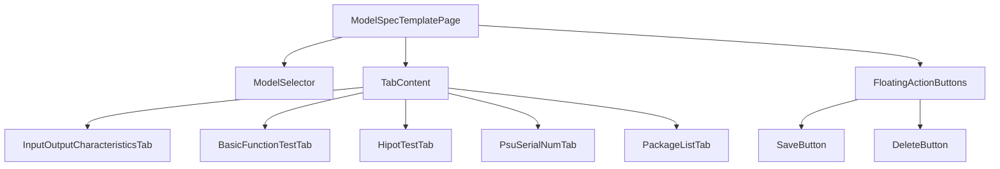

# Model Spec Template Page 技術文檔

**檔案路徑**: `lib/src/widget/admin/model_spec_template_page.dart`  
**用途**: 管理產品模型規格模板的管理員界面  
**版本**: 1.5.0  
**作者**: Zerova OQC Team  

---

## 📋 目錄

1. [概述](#概述)
2. [核心功能](#核心功能)
3. [架構設計](#架構設計)
4. [數據模型](#數據模型)
5. [UI 組件](#ui-組件)
6. [共用組件](#共用組件)
7. [API 接口](#api-接口)
8. [使用範例](#使用範例)
9. [錯誤處理](#錯誤處理)
10. [最佳實踐](#最佳實踐)

---

## 🎯 概述

`ModelSpecTemplatePage` 是 Zerova OQC 報告系統中的管理員頁面，專門用於管理產品模型的規格模板。它提供了完整的 CRUD (Create, Read, Update, Delete) 功能，讓管理員能夠：

- 創建新的產品模型規格
- 編輯現有模型的規格參數
- 查看和選擇可用的模型列表
- 刪除不需要的模型規格

---

## ⚙️ 核心功能

### 1. 模型管理
- **模型列表載入**: 從 Firebase 動態獲取所有可用模型
- **模型選擇**: 下拉選單選擇現有模型
- **新增模型**: 支援手動輸入新模型名稱
- **模型切換**: 在選擇模式和新增模式間切換

### 2. 規格編輯
- **多規格類型支援**: 
  - 輸入輸出特性 (InputOutputCharacteristics)
  - 基本功能測試 (BasicFunctionTest)
  - 耐壓測試 (HipotTest)
  - PSU序號規格 (PsuSerialNum)
  - 包裝清單規格 (PackageList) 🆕
- **即時編輯**: 支援即時修改規格參數
- **預設值處理**: 為新模型提供合理的預設規格值

### 3. 數據持久化
- **Firebase 整合**: 與 Firebase Firestore 完全整合
- **自動保存**: 支援手動保存規格到雲端
- **數據驗證**: 確保數據完整性和正確性

---

## 🏗 架構設計

### 類別結構

```dart
class ModelSpecTemplatePage extends StatefulWidget
└── _ModelSpecTemplatePageState extends State<ModelSpecTemplatePage>
    with SingleTickerProviderStateMixin
```

### 核心組件



### 狀態管理

| 狀態變數 | 類型 | 用途 |
|----------|------|------|
| `_modelList` | `List<String>` | 存儲可用模型列表 |
| `_selectedModel` | `String?` | 當前選擇的模型 |
| `_isLoading` | `bool` | 載入狀態指示器 |
| `_isNewModel` | `bool` | 新增模型模式開關 |
| `_tabController` | `TabController?` | 標籤頁控制器 (5個標籤) 🆕 |

---

## 📊 數據模型

### 規格類型定義

#### 1. InputOutputCharacteristicsSpec
```dart
class InputOutputCharacteristicsSpec {
  // 左側輸入輸出參數
  double leftVinLowerbound, leftVinUpperbound;  // 輸入電壓範圍
  double leftIinLowerbound, leftIinUpperbound;  // 輸入電流範圍
  double leftPinLowerbound, leftPinUpperbound;  // 輸入功率範圍
  double leftVoutLowerbound, leftVoutUpperbound; // 輸出電壓範圍
  double leftIoutLowerbound, leftIoutUpperbound; // 輸出電流範圍
  double leftPoutLowerbound, leftPoutUpperbound; // 輸出功率範圍
  
  // 右側輸入輸出參數 (結構相同)
  // ...
}
```

**預設值**:
- 左/右側輸入電壓：187-253V
- 左/右側輸入電流：0-230A
- 左/右側輸入功率：0-130W
- 左/右側輸出電壓：931-969V
- 左/右側輸出電流：123-129A
- 左/右側輸出功率：118-122W

#### 2. BasicFunctionTestSpec
```dart
class BasicFunctionTestSpec {
  double eff;  // 效率 (Efficiency)
  double pf;   // 功率因子 (Power Factor)
  double thd;  // 總諧波失真 (Total Harmonic Distortion)
  double sp;   // 軟啟動時間 (Soft Start)
}
```

**預設值**:
- 效率：94%
- 功率因子：0.99
- 總諧波失真：5%
- 軟啟動時間：100ms

#### 3. HipotTestSpec
```dart
class HipotTestSpec {
  double insulationimpedancespec;  // 絕緣阻抗規格
  double leakagecurrentspec;       // 漏電流規格
}
```

**預設值**:
- 絕緣阻抗規格：10 MΩ
- 漏電流規格：10 mA

#### 4. PsuSerialNumSpec
```dart
class PsuSerialNumSpec {
  int? qty;  // PSU數量規格
}
```

**預設值**:
- PSU數量：12個

#### 5. PackageListResult 🆕
```dart
class PackageListResult {
  final List<PackageListResultMeasurement> measurements;
  
  // 動態管理包裝項目
  void updateOrAddMeasurement({
    required int index,
    String? name,
    String? quantity,
    bool? isChecked,
  });
  
  void removeMeasurementAt(int index);
}

class PackageListResultMeasurement {
  int spec;
  final int key;
  String translationKey;
  String itemName;         // 項目名稱
  String quantity;         // 數量
  final ValueNotifier<bool> isCheck;  // 檢查狀態
}
```

**預設值**:
- PSU主體 (數量：1)
- 電源線 (數量：1)
- 使用手冊 (數量：1)
- 保固書 (數量：1)
- 包裝盒 (數量：1)

### Firebase 數據結構

```
models/
├── {modelId}/
│   ├── InputOutputCharacteristics/
│   │   └── spec/
│   ├── BasicFunctionTest/
│   │   └── spec/
│   ├── HipotTestSpec/
│   │   └── spec/
│   ├── PsuSerialNumSpec/
│   │   └── spec/
│   └── PackageListSpec/          🆕
│       └── spec/
│           └── measurements/
│               ├── 0/
│               │   ├── itemName: "PSU主體"
│               │   ├── quantity: "1"
│               │   └── isChecked: false
│               ├── 1/
│               └── ...
```

---

## 🎨 UI 組件

### 主要 UI 結構

```dart
MainLayout(
  ├── AppBar (標題 + 返回按鈕)
  ├── Body
  │   ├── ModelSelector (模型選擇器)
  │   └── TabContent (規格編輯標籤頁)
  └── FloatingActionButtons (操作按鈕)
)
```

### 組件詳細說明

#### 1. 模型選擇器 (`_buildModelSelector`)

**功能**: 提供模型選擇和新增功能

**特色**:
- 雙模式切換：選擇現有模型 ↔ 新增模型
- 下拉選單自動載入可用模型
- 即時切換和清空邏輯

#### 2. 標籤頁內容 (`_buildTabContent`) 🆕 更新

**功能**: 提供分類的規格編輯界面

**結構** (v1.5.0 更新):
```dart
TabBarView(
  children: [
    InputOutputCharacteristicsTab(...),
    BasicFunctionTestTab(...),
    HipotTestTab(...),
    PsuSerialNumTab(...),
    PackageListTab(              // 🆕 新增的包裝清單標籤頁
      spec: _packageListSpec,
      onChanged: (newSpec) => _packageListSpec = newSpec,
    ),
  ],
)
```

**標籤頁列表** (v1.5.0):
1. **輸入輸出特性**: 電壓、電流、功率範圍設定
2. **基本功能測試**: 效率、功率因子等參數
3. **耐壓測試**: 絕緣阻抗和漏電流規格
4. **PSU序號**: PSU數量設定
5. **包裝清單** 🆕: 產品包裝項目和數量管理

#### 3. 包裝清單標籤頁 (`PackageListTab`) 🆕

**檔案路徑**: `lib/src/widget/admin/tabs/package_list_tab.dart`

**功能特色**:
- **動態項目管理**: 可新增、編輯、刪除包裝項目
- **表格介面**: 清晰的項目列表顯示
- **即時編輯**: 支援直接編輯項目名稱和數量
- **預設項目**: 自動添加常見包裝項目

**UI 結構**:
```
┌─ 包裝清單規格 ──────────────── [新增項目] ─┐
├─────────────────────────────────────────┤
│ No. │     項目名稱      │ 數量  │   操作   │
├─────┼─────────────────┼─────┼─────────┤
│  1  │ [PSU主體      ] │ [1] │ [刪除🗑️] │
│  2  │ [電源線       ] │ [1] │ [刪除🗑️] │
│  3  │ [使用手冊     ] │ [1] │ [刪除🗑️] │
│ ... │       ...        │ ... │   ...    │
└─────────────────────────────────────────┘
```

**程式碼範例**:
```dart
PackageListTab(
  spec: _packageListSpec,
  onChanged: (newSpec) {
    setState(() {
      _packageListSpec = newSpec;
    });
  },
)
```

#### 4. 浮動操作按鈕 (`_buildFABs`)

**功能**: 提供保存和刪除操作

**配置**:
- 🟢 **保存按鈕**: 總是顯示，綠色背景
- 🔴 **刪除按鈕**: 僅在選擇模型時顯示，紅色背景

---

## 🔌 API 接口

### Firebase Service 整合 🆕 更新

#### 1. 載入模型規格 (v1.5.0 更新)
```dart
Future<void> _loadModelSpecs(String model) async {
  final specs = await firebaseService.getAllSpecs(
    model: model,
    tableNames: [
      'InputOutputCharacteristics', 
      'BasicFunctionTest', 
      'HipotTestSpec',
      'PsuSerialNumSpec'
    ],
  );
  
  // 🆕 載入 PackageListSpec (使用專用方法)
  final packageListResult = await fetchPackageListSpec(model);
  
  // 設置規格對象...
  _packageListSpec = packageListResult ?? PackageListResult(); // 🆕
}
```

#### 2. 保存模型規格 (v1.5.0 更新)
```dart
Future<void> _saveModelSpecs() async {
  // 保存其他規格...
  
  // 🆕 保存 PackageListSpec 規格
  if (_packageListSpec != null) {
    await uploadPackageListSpec(
      model: model,
      tableName: 'PackageListSpec',
      packageListResult: _packageListSpec!,
    );
  }
}
```

#### 3. 包裝清單專用 API 🆕

**fetchPackageListSpec**: 從 Firestore 載入包裝清單規格
```dart
Future<PackageListResult?> fetchPackageListSpec(String model) async {
  // 從 /models/{model}/PackageListSpec/spec 載入資料
  // 轉換 Firestore 格式為 PackageListResult 對象
}
```

**uploadPackageListSpec**: 上傳包裝清單規格到 Firestore
```dart
Future<bool> uploadPackageListSpec({
  required String model,
  required String tableName,
  required PackageListResult packageListResult,
}) async {
  // 將 PackageListResult 轉換為 Firestore 格式
  // 保存到指定路徑
}
```

### API 方法對應表 🆕 更新

| 操作 | Firebase Service 方法 | 說明 |
|------|---------------------|------|
| 取得模型列表 | `getModelList()` | 獲取所有可用模型 |
| 讀取規格 | `getAllSpecs()` | 批量讀取多種規格 |
| 保存規格 | `addOrUpdateSpec()` | 新增或更新單一規格 |
| 讀取包裝清單 🆕 | `fetchPackageListSpec()` | 專用包裝清單讀取 |
| 保存包裝清單 🆕 | `uploadPackageListSpec()` | 專用包裝清單保存 |

---

## 💻 使用範例

### 包裝清單管理範例 🆕

```dart
class PackageListExample {
  // 創建包裝清單規格
  PackageListResult createPackageListSpec() {
    final spec = PackageListResult();
    
    // 添加標準包裝項目
    spec.updateOrAddMeasurement(
      index: 0,
      name: 'PSU主體',
      quantity: '1',
      isChecked: false,
    );
    
    spec.updateOrAddMeasurement(
      index: 1,
      name: '電源線',
      quantity: '1',
      isChecked: false,
    );
    
    return spec;
  }
  
  // 保存包裝清單
  Future<void> savePackageList(String model, PackageListResult spec) async {
    final success = await uploadPackageListSpec(
      model: model,
      tableName: 'PackageListSpec',
      packageListResult: spec,
    );
    
    print('保存結果: ${success ? '成功' : '失敗'}');
  }
}
```

### 完整模型創建流程 🆕

```dart
Future<void> createCompleteModel() async {
  final model = 'NEW_MODEL_V2';
  
  // 1. 創建輸入輸出特性規格
  final ioSpec = InputOutputCharacteristicsSpec(
    leftVinLowerbound: 187,
    leftVinUpperbound: 253,
    // ...
  );
  
  // 2. 創建基本功能測試規格
  final bfSpec = BasicFunctionTestSpec(
    eff: 94,
    pf: 0.99,
    thd: 5,
    sp: 100,
  );
  
  // 3. 創建耐壓測試規格
  final htSpec = HipotTestSpec(
    insulationimpedancespec: 10,
    leakagecurrentspec: 10,
  );
  
  // 4. 創建PSU序號規格
  final psuSpec = PsuSerialNumSpec(qty: 12);
  
  // 5. 🆕 創建包裝清單規格
  final packageSpec = PackageListResult();
  // 會自動添加預設項目
  
  // 6. 保存所有規格
  final firebaseService = FirebaseService();
  
  await firebaseService.addOrUpdateSpec(
    model: model,
    tableName: 'InputOutputCharacteristics',
    spec: ioSpec.toJson(),
  );
  
  // ... 保存其他規格
  
  // 🆕 保存包裝清單規格
  await uploadPackageListSpec(
    model: model,
    tableName: 'PackageListSpec',
    packageListResult: packageSpec,
  );
}
```

---

## ⚠️ 錯誤處理

### 刪除確認 (v1.5.0 更新)

```dart
final confirm = await showDialog<bool>(
  context: context,
  builder: (context) => AlertDialog(
    title: const Text('確認刪除'),
    content: Text('確定要刪除 $_selectedModel 的所有規格嗎？此操作無法恢復。\n\n將刪除以下內容：\n• 輸入輸出特性規格\n• 基本功能測試規格\n• 耐壓測試規格\n• PSU序號規格\n• 包裝清單規格\n• 相關的失敗計數記錄'), // 🆕 包含包裝清單規格
    // ...
  ),
);
```

### 包裝清單特定錯誤處理 🆕

```dart
// 項目驗證
void validatePackageListItem(String itemName, String quantity) {
  if (itemName.trim().isEmpty) {
    throw Exception('項目名稱不能為空');
  }
  
  final qty = int.tryParse(quantity);
  if (qty == null || qty <= 0) {
    throw Exception('數量必須是正整數');
  }
}

// 保存錯誤處理
try {
  await uploadPackageListSpec(
    model: model,
    tableName: 'PackageListSpec',
    packageListResult: _packageListSpec!,
  );
} catch (e) {
  if (context.mounted) {
    ScaffoldMessenger.of(context).showSnackBar(
      SnackBar(content: Text('保存包裝清單失敗: $e')),
    );
  }
}
```

---

## 🚀 最佳實踐

### 包裝清單管理最佳實踐 🆕

```dart
class PackageListBestPractices {
  // 1. 統一的項目創建
  PackageListResult createStandardPackageList() {
    final standardItems = [
      {'name': 'PSU主體', 'qty': '1'},
      {'name': '電源線', 'qty': '1'},
      {'name': '使用手冊', 'qty': '1'},
      {'name': '保固書', 'qty': '1'},
      {'name': '包裝盒', 'qty': '1'},
    ];
    
    final spec = PackageListResult();
    for (int i = 0; i < standardItems.length; i++) {
      spec.updateOrAddMeasurement(
        index: i,
        name: standardItems[i]['name']!,
        quantity: standardItems[i]['qty']!,
        isChecked: false,
      );
    }
    
    return spec;
  }
  
  // 2. 數據一致性檢查
  bool validatePackageList(PackageListResult spec) {
    for (final measurement in spec.measurements) {
      if (measurement.itemName.trim().isEmpty) return false;
      if (int.tryParse(measurement.quantity) == null) return false;
    }
    return true;
  }
  
  // 3. 控制器管理
  void disposeControllers(List<TextEditingController> controllers) {
    for (final controller in controllers) {
      controller.dispose();
    }
    controllers.clear();
  }
}
```

---

## 📖 相關文檔

- [包裝清單標籤頁文檔](./PackageListTab.md) 🆕
- [包裝清單結果模型文檔](./PackageListResult.md) 🆕
- [共用組件文檔](./SpecInputField.md)
- [Firebase Service 文檔](./FirebaseService.md)
- [資料結構文檔](./DataStructure.md)
- [PSU序號規格文檔](./PsuSerialNumSpec.md)
- [OQC 系統總覽](../README.md)

---

## 🔄 版本記錄

| 版本 | 日期 | 變更內容 |
|------|------|----------|
| 1.0.0 | 2024-01-01 | 初版發布，支援基本 CRUD 功能 |
| 1.1.0 | 2024-01-15 | 新增模型自動發現功能 |
| 1.2.0 | 2024-02-01 | 改進錯誤處理和使用者體驗 |
| 1.3.0 | 2024-02-15 | 重構使用共用組件，提高代碼複用性 |
| 1.4.0 | 2024-12-19 | 新增PSU序號規格支援，更新預設值，4個標籤頁界面 |
| 1.5.0 | 2024-12-19 | 🆕 新增包裝清單規格支援，5個標籤頁界面，專用 API 方法 |

---

**維護者**: Zerova OQC Team  
**最後更新**: 2024-12-19  
**許可證**: MIT License 