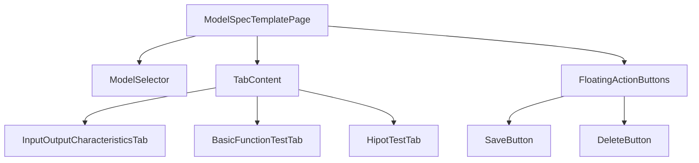

# Model Spec Template Page 技術文檔

**檔案路徑**: `lib/src/widget/admin/model_spec_template_page.dart`  
**用途**: 管理產品模型規格模板的管理員界面  
**版本**: 1.3.0  
**作者**: Zerova OQC Team  

---

## 📋 目錄

1. [概述](#概述)
2. [核心功能](#核心功能)
3. [架構設計](#架構設計)
4. [數據模型](#數據模型)
5. [UI 組件](#ui-組件)
6. [共用組件](#共用組件)
7. [API 接口](#api-接口)
8. [使用範例](#使用範例)
9. [錯誤處理](#錯誤處理)
10. [最佳實踐](#最佳實踐)

---

## 🎯 概述

`ModelSpecTemplatePage` 是 Zerova OQC 報告系統中的管理員頁面，專門用於管理產品模型的規格模板。它提供了完整的 CRUD (Create, Read, Update, Delete) 功能，讓管理員能夠：

- 創建新的產品模型規格
- 編輯現有模型的規格參數
- 查看和選擇可用的模型列表
- 刪除不需要的模型規格

---

## ⚙️ 核心功能

### 1. 模型管理
- **模型列表載入**: 從 Firebase 動態獲取所有可用模型
- **模型選擇**: 下拉選單選擇現有模型
- **新增模型**: 支援手動輸入新模型名稱
- **模型切換**: 在選擇模式和新增模式間切換

### 2. 規格編輯
- **多規格類型支援**: 
  - 輸入輸出特性 (InputOutputCharacteristics)
  - 基本功能測試 (BasicFunctionTest)
  - 耐壓測試 (HipotTest)
- **即時編輯**: 支援即時修改規格參數
- **預設值處理**: 為新模型提供合理的預設規格值

### 3. 數據持久化
- **Firebase 整合**: 與 Firebase Firestore 完全整合
- **自動保存**: 支援手動保存規格到雲端
- **數據驗證**: 確保數據完整性和正確性

---

## 🏗 架構設計

### 類別結構

```dart
class ModelSpecTemplatePage extends StatefulWidget
└── _ModelSpecTemplatePageState extends State<ModelSpecTemplatePage>
    with SingleTickerProviderStateMixin
```

### 核心組件



### 狀態管理

| 狀態變數 | 類型 | 用途 |
|----------|------|------|
| `_modelList` | `List<String>` | 存儲可用模型列表 |
| `_selectedModel` | `String?` | 當前選擇的模型 |
| `_isLoading` | `bool` | 載入狀態指示器 |
| `_isNewModel` | `bool` | 新增模型模式開關 |
| `_tabController` | `TabController?` | 標籤頁控制器 |

---

## 📊 數據模型

### 規格類型定義

#### 1. InputOutputCharacteristicsSpec
```dart
class InputOutputCharacteristicsSpec {
  // 左側輸入輸出參數
  double leftVinLowerbound, leftVinUpperbound;  // 輸入電壓範圍
  double leftIinLowerbound, leftIinUpperbound;  // 輸入電流範圍
  double leftPinLowerbound, leftPinUpperbound;  // 輸入功率範圍
  double leftVoutLowerbound, leftVoutUpperbound; // 輸出電壓範圍
  double leftIoutLowerbound, leftIoutUpperbound; // 輸出電流範圍
  double leftPoutLowerbound, leftPoutUpperbound; // 輸出功率範圍
  
  // 右側輸入輸出參數 (結構相同)
  // ...
}
```

#### 2. BasicFunctionTestSpec
```dart
class BasicFunctionTestSpec {
  double eff;  // 效率 (Efficiency)
  double pf;   // 功率因子 (Power Factor)
  double thd;  // 總諧波失真 (Total Harmonic Distortion)
  double sp;   // 軟啟動時間 (Soft Start)
}
```

#### 3. HipotTestSpec
```dart
class HipotTestSpec {
  double insulationimpedancespec;  // 絕緣阻抗規格
  double leakagecurrentspec;       // 漏電流規格
}
```

### Firebase 數據結構

```
models/
├── {modelId}/
│   ├── InputOutputCharacteristics/
│   │   └── spec/
│   ├── BasicFunctionTest/
│   │   └── spec/
│   └── HipotTestSpec/
│       └── spec/
```

---

## 🎨 UI 組件

### 主要 UI 結構

```dart
MainLayout(
  ├── AppBar (標題 + 返回按鈕)
  ├── Body
  │   ├── ModelSelector (模型選擇器)
  │   └── TabContent (規格編輯標籤頁)
  └── FloatingActionButtons (操作按鈕)
)
```

### 組件詳細說明

#### 1. 模型選擇器 (`_buildModelSelector`)

**功能**: 提供模型選擇和新增功能

**特色**:
- 雙模式切換：選擇現有模型 ↔ 新增模型
- 下拉選單自動載入可用模型
- 即時切換和清空邏輯

**程式碼範例**:
```dart
Widget _buildModelSelector() {
  return Card(
    child: Column(
      children: [
        // 模式切換按鈕
        ElevatedButton.icon(
          onPressed: _toggleNewModelMode,
          icon: Icon(_isNewModel ? Icons.list : Icons.add),
          label: Text(_isNewModel ? '選擇現有模型' : '新增模型'),
        ),
        
        // 選擇/輸入介面
        if (!_isNewModel) 
          DropdownButtonFormField<String>(...) // 下拉選單
        else 
          TextField(...) // 文字輸入框
      ],
    ),
  );
}
```

#### 2. 標籤頁內容 (`_buildTabContent`)

**功能**: 提供分類的規格編輯界面

**結構**:
```dart
TabBarView(
  children: [
    InputOutputCharacteristicsTab(
      spec: _inputOutputSpec,
      onChanged: (newSpec) => setState(() => _inputOutputSpec = newSpec),
    ),
    BasicFunctionTestTab(...),
    HipotTestTab(...),
  ],
)
```

#### 3. 浮動操作按鈕 (`_buildFABs`)

**功能**: 提供保存和刪除操作

**配置**:
- 🟢 **保存按鈕**: 總是顯示，綠色背景
- 🔴 **刪除按鈕**: 僅在選擇模型時顯示，紅色背景

---

## 🚧 共用組件

為了減少代碼重複和提高維護性，我們建立了一套共用的規格輸入組件。

### SpecInputField

**檔案路徑**: `lib/src/widget/common/spec_input_field.dart`

基礎的規格輸入欄位組件，提供統一的 TextField 樣式和行為。

```dart
SpecInputField(
  label: '數值',
  controller: controller,
  unit: 'V',
  isRequired: true,
  onChanged: (value) => print('值改變: $value'),
)
```

**特色功能**:
- 統一的 OutlineInputBorder 樣式
- 自動數值鍵盤類型
- 單位顯示 (suffixText)
- 必填欄位標記 (*)
- 禁用狀態視覺效果

### LabeledSpecInputField

帶有左側標籤的輸入欄位，適用於需要標籤-輸入框組合的場景。

```dart
LabeledSpecInputField(
  label: '絕緣阻抗規格',
  unit: 'MΩ',
  controller: controller,
  labelWidth: 150,
  isRequired: true,
)
```

**使用場景**:
- `HipotTestTab`: 耐壓測試規格輸入
- `BasicFunctionTestTab`: 基本功能測試參數

### RangeSpecInputField

範圍輸入組件，用於需要下限-上限配對輸入的場景。

```dart
RangeSpecInputField(
  label: 'Vin (V)',
  unit: 'V',
  lowerController: lowerController,
  upperController: upperController,
  isRequired: true,
)
```

**使用場景**:
- `InputOutputCharacteristicsTab`: 所有輸入輸出特性範圍

### SpecInputUtils

提供規格輸入相關的工具方法。

```dart
// 數值驗證
String? error = SpecInputUtils.numberValidator(value, required: true);

// 範圍驗證
String? rangeError = SpecInputUtils.rangeValidator(lowerValue, upperValue);

// 格式化顯示
String formatted = SpecInputUtils.formatNumber(123.456, decimalPlaces: 2);

// 控制器操作
double? value = SpecInputUtils.getNumberFromController(controller);
SpecInputUtils.setControllerNumber(controller, 123.45);
```

### 組件比較表

| 組件 | 使用場景 | 主要特色 | 適用頁面 |
|------|----------|----------|----------|
| `SpecInputField` | 基礎數值輸入 | 簡單統一的樣式 | 所有規格頁面 |
| `LabeledSpecInputField` | 標籤+輸入框 | 左側標籤顯示 | Hipot, BasicFunction |
| `RangeSpecInputField` | 範圍輸入 | 下限-上限配對 | InputOutput |

---

## 🔌 API 接口

### Firebase Service 整合

#### 1. 載入模型列表
```dart
Future<void> _loadModelList() async {
  final firebaseService = FirebaseService();
  final models = await firebaseService.getModelList();
  setState(() {
    _modelList.addAll(models);
  });
}
```

#### 2. 載入模型規格
```dart
Future<void> _loadModelSpecs(String model) async {
  final specs = await firebaseService.getAllSpecs(
    model: model,
    tableNames: ['InputOutputCharacteristics', 'BasicFunctionTest', 'HipotTestSpec'],
  );
  
  // 轉換並設置規格對象
  _inputOutputSpec = InputOutputCharacteristicsSpec.fromJson(specs['InputOutputCharacteristics']);
  // ...
}
```

#### 3. 保存模型規格
```dart
Future<void> _saveModelSpecs() async {
  final firebaseService = FirebaseService();
  
  // 保存各類型規格
  await firebaseService.addOrUpdateSpec(
    model: model,
    tableName: 'InputOutputCharacteristics',
    spec: _inputOutputSpec!.toJson(),
  );
  // ...
}
```

### API 方法對應表

| 操作 | Firebase Service 方法 | 說明 |
|------|---------------------|------|
| 取得模型列表 | `getModelList()` | 獲取所有可用模型 |
| 讀取規格 | `getAllSpecs()` | 批量讀取多種規格 |
| 保存規格 | `addOrUpdateSpec()` | 新增或更新單一規格 |

---

## 💻 使用範例

### 基本使用流程

```dart
// 1. 導航到模型規格頁面
Navigator.push(
  context,
  MaterialPageRoute(builder: (context) => const ModelSpecTemplatePage()),
);

// 2. 頁面自動載入模型列表
// 3. 用戶選擇模型或新增模型
// 4. 編輯規格參數
// 5. 點擊保存按鈕
```

### 程式化操作範例

```dart
class ExampleUsage {
  // 創建新模型規格
  Future<void> createNewModelSpec() async {
    final page = ModelSpecTemplatePage();
    
    // 模擬新增模型
    final newSpec = InputOutputCharacteristicsSpec(
      leftVinLowerbound: 100,
      leftVinUpperbound: 240,
      // ... 其他參數
    );
    
    // 保存到 Firebase
    await FirebaseService().addOrUpdateSpec(
      model: 'NEW_MODEL_001',
      tableName: 'InputOutputCharacteristics',
      spec: newSpec.toJson(),
    );
  }
}
```

---

## ⚠️ 錯誤處理

### 異常處理策略

#### 1. 網路錯誤處理
```dart
try {
  final models = await firebaseService.getModelList();
  // 成功處理
} catch (e) {
  if (context.mounted) {
    ScaffoldMessenger.of(context).showSnackBar(
      SnackBar(content: Text('載入模型列表失敗: $e')),
    );
  }
}
```

#### 2. 數據驗證
```dart
Future<void> _saveModelSpecs() async {
  // 驗證模型選擇
  if (_selectedModel == null && !_isNewModel) {
    ScaffoldMessenger.of(context).showSnackBar(
      const SnackBar(content: Text('請先選擇或新增一個模型')),
    );
    return;
  }
  
  // 驗證模型名稱
  final model = _isNewModel ? _modelController.text : _selectedModel!;
  if (model.isEmpty) {
    ScaffoldMessenger.of(context).showSnackBar(
      const SnackBar(content: Text('模型名稱不能為空')),
    );
    return;
  }
}
```

#### 3. 刪除確認
```dart
final confirm = await showDialog<bool>(
  context: context,
  builder: (context) => AlertDialog(
    title: const Text('確認刪除'),
    content: Text('確定要刪除 $_selectedModel 的所有規格嗎？此操作無法恢復。'),
    actions: [
      TextButton(onPressed: () => Navigator.pop(context, false), child: Text('取消')),
      TextButton(onPressed: () => Navigator.pop(context, true), child: Text('刪除')),
    ],
  ),
);
```

### 常見錯誤及解決方案

| 錯誤類型 | 可能原因 | 解決方案 |
|----------|----------|----------|
| 載入模型失敗 | 網路連接問題、Firebase 權限 | 檢查網路連接和 API 權限 |
| 保存失敗 | 數據格式錯誤、網路中斷 | 驗證數據格式，重試保存 |
| 規格載入失敗 | 模型不存在、數據損壞 | 提供預設值，友善錯誤訊息 |

---

## 🚀 最佳實踐

### 1. 效能優化

```dart
// 使用適當的生命週期管理
@override
void dispose() {
  _modelController.dispose();
  _tabController?.dispose();
  super.dispose();
}

// 避免不必要的重建
const SizedBox(height: 20), // 使用 const
```

### 2. 狀態管理

```dart
// 確保在適當的時機更新 UI
setState(() {
  _isLoading = true;
});

// 檢查 widget 是否還在樹中
if (context.mounted) {
  ScaffoldMessenger.of(context).showSnackBar(snackBar);
}
```

### 3. 共用組件使用

```dart
// 好的做法：使用共用組件
LabeledSpecInputField(
  label: '規格名稱',
  unit: '單位',
  controller: controller,
  isRequired: true,
)

// 不好的做法：重複創建 TextField
TextField(
  controller: controller,
  decoration: InputDecoration(
    border: const OutlineInputBorder(),
    contentPadding: const EdgeInsets.symmetric(horizontal: 12, vertical: 8),
    suffixText: '單位',
  ),
  keyboardType: const TextInputType.numberWithOptions(decimal: true),
)
```

### 4. 數據一致性

```dart
// 提供合理的預設值
_inputOutputSpec = InputOutputCharacteristicsSpec(
  leftVinLowerbound: 0,
  leftVinUpperbound: 0,
  // ...
);

// 數據驗證
if (specMap != null && specMap.isNotEmpty) {
  _inputOutputSpec = InputOutputCharacteristicsSpec.fromJson(specMap);
} else {
  // 使用預設值
}
```

### 5. 使用者體驗

```dart
// 載入狀態指示
if (_isLoading)
  Container(
    color: Colors.black54,
    child: const Center(child: CircularProgressIndicator()),
  ),

// 友善的錯誤訊息
ScaffoldMessenger.of(context).showSnackBar(
  SnackBar(content: Text('模型規格 $model 已成功保存')),
);
```

### 6. 代碼重構原則

**重構前的問題**:
```dart
// 重複的 TextField 代碼分散在多個文件中
Widget _buildInputField(String label, String unit, TextEditingController controller) {
  return Row(
    children: [
      SizedBox(width: 150, child: Text(label)),
      Expanded(
        child: TextField(
          controller: controller,
          decoration: InputDecoration(
            border: const OutlineInputBorder(),
            contentPadding: const EdgeInsets.symmetric(horizontal: 12, vertical: 8),
            suffixText: unit,
          ),
          keyboardType: const TextInputType.numberWithOptions(decimal: true),
        ),
      ),
    ],
  );
}
```

**重構後的優勢**:
- **一致性**: 所有輸入欄位使用相同的樣式和行為
- **維護性**: 修改樣式只需要更新一個地方
- **擴展性**: 新增功能（如驗證、必填標記）自動應用到所有使用處
- **可讀性**: 代碼更簡潔，意圖更明確

---

## 📖 相關文檔

- [共用組件文檔](./SpecInputField.md)
- [Firebase Service 文檔](./FirebaseService.md)
- [資料結構文檔](./DataStructure.md)
- [UI 組件庫文檔](./UIComponents.md)
- [OQC 系統總覽](../README.md)

---

## 🔄 版本記錄

| 版本 | 日期 | 變更內容 |
|------|------|----------|
| 1.0.0 | 2024-01-01 | 初版發布，支援基本 CRUD 功能 |
| 1.1.0 | 2024-01-15 | 新增模型自動發現功能 |
| 1.2.0 | 2024-02-01 | 改進錯誤處理和使用者體驗 |
| 1.3.0 | 2024-02-15 | 重構使用共用組件，提高代碼複用性 |

---

**維護者**: Zerova OQC Team  
**最後更新**: 2024-02-15  
**許可證**: MIT License 