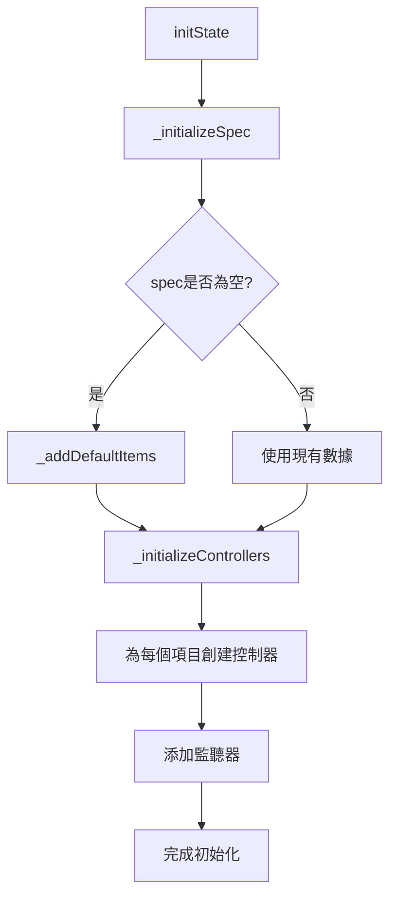
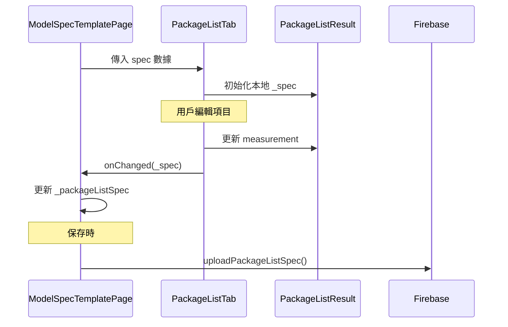

# PackageListTab 技術文檔

**檔案路徑**: `lib/src/widget/admin/tabs/package_list_tab.dart`  
**用途**: 包裝清單規格編輯標籤頁組件  
**版本**: 1.0.0  
**作者**: Zerova OQC Team  

---

## 📋 目錄

1. [概述](#概述)
2. [核心功能](#核心功能)
3. [UI 設計](#ui-設計)
4. [狀態管理](#狀態管理)
5. [API 接口](#api-接口)
6. [使用範例](#使用範例)
7. [最佳實踐](#最佳實踐)

---

## 🎯 概述

`PackageListTab` 是 `ModelSpecTemplatePage` 中第五個標籤頁，專門用於管理產品包裝清單規格。它提供了完整的動態項目管理功能，讓管理員能夠：

- 新增自定義包裝項目
- 編輯項目名稱和數量
- 刪除不需要的項目
- 查看預設的標準包裝項目

---

## ⚙️ 核心功能

### 1. 動態項目管理
- **新增項目**: 點擊「新增項目」按鈕動態添加包裝項目
- **即時編輯**: 直接在表格中編輯項目名稱和數量
- **刪除項目**: 每個項目都有刪除按鈕，支援動態移除
- **自動編號**: 系統自動為項目分配序號

### 2. 預設項目支援
當創建新的包裝清單規格時，系統會自動添加以下預設項目：
- PSU主體 (數量：1)
- 電源線 (數量：1)
- 使用手冊 (數量：1)
- 保固書 (數量：1)
- 包裝盒 (數量：1)

### 3. 數據持久化
- **即時保存**: 每次修改都會通過 `onChanged` 回調觸發保存
- **狀態同步**: 與 `PackageListResult` 模型保持同步
- **Firebase 整合**: 支援透過專用 API 保存到雲端

---

## 🎨 UI 設計

### 整體布局

```
┌─────────────────────────────────────────────────────────────┐
│ 包裝清單規格                              [新增項目]        │
├─────────────────────────────────────────────────────────────┤
│ ┌─────────────────────────────────────────────────────────┐ │
│ │ No. │        項目名稱        │  數量  │     操作      │ │
│ ├─────┼─────────────────────┼──────┼──────────────┤ │
│ │  1  │ [PSU主體           ] │ [1]  │ [刪除 🗑️]   │ │
│ │  2  │ [電源線             ] │ [1]  │ [刪除 🗑️]   │ │
│ │  3  │ [使用手冊           ] │ [1]  │ [刪除 🗑️]   │ │
│ │  4  │ [保固書             ] │ [1]  │ [刪除 🗑️]   │ │
│ │  5  │ [包裝盒             ] │ [1]  │ [刪除 🗑️]   │ │
│ └─────────────────────────────────────────────────────────┘ │
├─────────────────────────────────────────────────────────────┤
│ ℹ️ 說明                                                     │
│ • 包裝清單: 設定此模型的包裝清單項目和數量                  │
│ • 可以新增、編輯或刪除包裝項目                              │
│ • 每個項目包含名稱和數量                                    │
│ • 此設定將用於 OQC 報告的包裝清單表格                      │
└─────────────────────────────────────────────────────────────┘
```

### 組件結構

```dart
Widget build(BuildContext context) {
  return Card(
    elevation: 4,
    child: Padding(
      padding: const EdgeInsets.all(16.0),
      child: Column(
        children: [
          _buildHeader(),           // 標題和新增按鈕
          _buildTableHeader(),      // 表格標頭
          _buildItemsList(),        // 項目列表
          _buildInfoSection(),      // 說明區塊
        ],
      ),
    ),
  );
}
```

### 視覺特色

#### 1. 表格設計
- **邊框樣式**: 使用 `Colors.grey.shade300` 統一邊框
- **標頭背景**: `Colors.grey.shade100` 區分標頭和內容
- **圓角設計**: 頂部和底部使用不同的圓角半徑

#### 2. 交互反饋
- **刪除按鈕**: 紅色圖標，清楚標示危險操作
- **新增按鈕**: 綠色主色調，位於右上角
- **輸入框**: 標準的 `OutlineInputBorder` 樣式

#### 3. 響應式布局
- **彈性比例**: 項目名稱欄位使用 `flex: 3`，數量欄位使用 `flex: 1`
- **固定寬度**: 序號欄位固定 40px，操作欄位固定 60px
- **滾動支援**: 使用 `ListView.builder` 支援大量項目

---

## 🔄 狀態管理

### 核心狀態變數

| 變數名稱 | 類型 | 用途 |
|----------|------|------|
| `_spec` | `PackageListResult` | 包裝清單數據模型 |
| `_itemControllers` | `List<TextEditingController>` | 項目名稱輸入控制器列表 |
| `_quantityControllers` | `List<TextEditingController>` | 數量輸入控制器列表 |

### 狀態初始化流程



### 控制器管理

```dart
void _initializeControllers() {
  for (int i = 0; i < _spec.measurements.length; i++) {
    final measurement = _spec.measurements[i];
    
    // 創建控制器並設定初始值
    final itemController = TextEditingController(text: measurement.itemName);
    final quantityController = TextEditingController(text: measurement.quantity);
    
    // 添加監聽器實現即時更新
    itemController.addListener(() => 
      _updateMeasurement(i, 'itemName', itemController.text));
    quantityController.addListener(() => 
      _updateMeasurement(i, 'quantity', quantityController.text));
    
    // 加入控制器列表
    _itemControllers.add(itemController);
    _quantityControllers.add(quantityController);
  }
}
```

### 記憶體管理

```dart
@override
void dispose() {
  _disposeControllers();  // 釋放所有控制器
  super.dispose();
}

void _disposeControllers() {
  for (final controller in _itemControllers) {
    controller.dispose();
  }
  for (final controller in _quantityControllers) {
    controller.dispose();
  }
  _itemControllers.clear();
  _quantityControllers.clear();
}
```

---

## 🔌 API 接口

### 組件接口

```dart
class PackageListTab extends StatefulWidget {
  final PackageListResult? spec;                    // 輸入的規格數據
  final Function(PackageListResult) onChanged;      // 變更回調函數

  const PackageListTab({
    super.key,
    required this.spec,
    required this.onChanged,
  });
}
```

### 回調方法

#### onChanged 觸發時機
1. **項目名稱修改**: 用戶在項目名稱輸入框中輸入時
2. **數量修改**: 用戶在數量輸入框中輸入時
3. **新增項目**: 點擊「新增項目」按鈕後
4. **刪除項目**: 點擊刪除按鈕後

```dart
// 更新測量項目
void _updateMeasurement(int index, String field, String value) {
  if (index < _spec.measurements.length) {
    switch (field) {
      case 'itemName':
        _spec.measurements[index].itemName = value;
        break;
      case 'quantity':
        _spec.measurements[index].quantity = value;
        break;
    }
    widget.onChanged(_spec);  // 觸發父組件更新
  }
}
```

### 與父組件的數據流



---

## 💻 使用範例

### 在 ModelSpecTemplatePage 中使用

```dart
class _ModelSpecTemplatePageState extends State<ModelSpecTemplatePage> {
  PackageListResult? _packageListSpec;
  
  // 在 TabBarView 中加入 PackageListTab
  Widget _buildTabContent() {
    return TabBarView(
      controller: _tabController,
      children: [
        // ... 其他標籤頁
        PackageListTab(
          spec: _packageListSpec,
          onChanged: (newSpec) {
            setState(() {
              _packageListSpec = newSpec;
            });
          },
        ),
      ],
    );
  }
}
```

### 創建自定義包裝清單

```dart
class CustomPackageListExample {
  PackageListResult createCustomList() {
    final spec = PackageListResult();
    
    // 自定義項目
    final customItems = [
      {'name': '充電纜線', 'qty': '2'},
      {'name': '壁掛支架', 'qty': '1'},
      {'name': '安裝配件包', 'qty': '1'},
      {'name': 'RFID卡', 'qty': '5'},
    ];
    
    for (int i = 0; i < customItems.length; i++) {
      spec.updateOrAddMeasurement(
        index: i,
        name: customItems[i]['name']!,
        quantity: customItems[i]['qty']!,
        isChecked: false,
      );
    }
    
    return spec;
  }
}
```

### 數據驗證範例

```dart
class PackageListValidator {
  static String? validateItemName(String name) {
    if (name.trim().isEmpty) {
      return '項目名稱不能為空';
    }
    if (name.length > 50) {
      return '項目名稱不能超過50個字符';
    }
    return null;
  }
  
  static String? validateQuantity(String quantity) {
    final qty = int.tryParse(quantity);
    if (qty == null) {
      return '數量必須是整數';
    }
    if (qty <= 0) {
      return '數量必須大於0';
    }
    if (qty > 999) {
      return '數量不能超過999';
    }
    return null;
  }
  
  static bool validatePackageList(PackageListResult spec) {
    for (final measurement in spec.measurements) {
      if (validateItemName(measurement.itemName) != null) return false;
      if (validateQuantity(measurement.quantity) != null) return false;
    }
    return true;
  }
}
```

---

## 🚀 最佳實踐

### 1. 效能優化

```dart
// 好的做法：使用 const 建構子
const Row(
  children: [
    SizedBox(width: 40, child: Text('No.')),
    Expanded(child: Text('項目名稱')),
  ],
)

// 避免在 build 方法中創建不必要的對象
final decoration = BoxDecoration(
  border: Border.all(color: Colors.grey.shade300),
);
```

### 2. 用戶體驗

```dart
// 提供清楚的提示文字
TextField(
  decoration: const InputDecoration(
    hintText: '輸入項目名稱',  // 明確的提示
    border: OutlineInputBorder(),
  ),
)

// 使用語義化的圖標
IconButton(
  icon: const Icon(Icons.delete, color: Colors.red),
  tooltip: '刪除此項目',  // 提供工具提示
  onPressed: () => _removeItem(index),
)
```

### 3. 錯誤處理

```dart
void _removeItem(int index) {
  // 邊界檢查
  if (index < 0 || index >= _spec.measurements.length) {
    return;
  }
  
  try {
    _spec.removeMeasurementAt(index);
    
    // 安全地移除控制器
    if (index < _itemControllers.length) {
      _itemControllers[index].dispose();
      _itemControllers.removeAt(index);
    }
    
    setState(() {});
    widget.onChanged(_spec);
  } catch (e) {
    // 記錄錯誤但不讓應用崩潰
    debugPrint('Error removing item at index $index: $e');
  }
}
```

### 4. 可訪問性

```dart
// 為視覺障礙用戶提供語義信息
Semantics(
  label: '包裝項目 ${index + 1}',
  child: TextField(
    controller: _itemControllers[index],
    // ...
  ),
)

// 使用適當的鍵盤類型
TextField(
  keyboardType: TextInputType.number,  // 數量輸入使用數字鍵盤
  decoration: const InputDecoration(
    hintText: '數量',
  ),
)
```

### 5. 代碼組織

```dart
class _PackageListTabState extends State<PackageListTab> {
  // 將複雜的 build 方法拆分為小方法
  Widget _buildHeader() => Row(/* ... */);
  Widget _buildTableHeader() => Container(/* ... */);
  Widget _buildItemsList() => Expanded(/* ... */);
  Widget _buildInfoSection() => Container(/* ... */);
  
  // 將業務邏輯分離
  void _addNewItem() { /* ... */ }
  void _removeItem(int index) { /* ... */ }
  void _updateMeasurement(int index, String field, String value) { /* ... */ }
}
```

---

## 📖 相關文檔

- [PackageListResult 模型文檔](./PackageListResult.md)
- [ModelSpecTemplatePage 主頁面文檔](./ModelSpecTemplatePage.md)
- [DataStructure 數據結構文檔](./DataStructure.md)
- [Firebase Service API 文檔](./FirebaseService.md)

---

## 🔄 版本記錄

| 版本 | 日期 | 變更內容 |
|------|------|----------|
| 1.0.0 | 2024-12-19 | 🆕 初版發布，支援動態包裝清單管理 |

---

**維護者**: Zerova OQC Team  
**最後更新**: 2024-12-19  
**許可證**: MIT License 