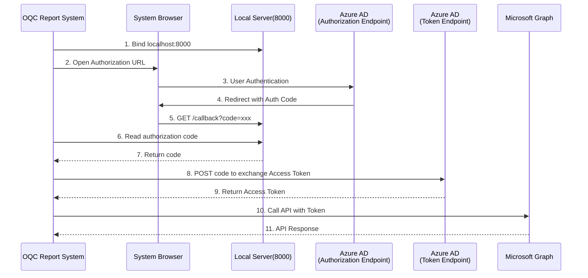

# SharePoint Microsoft Graph API Implementation Documentation

**File Path**: `lib/src/repo/sharepoint_uploader.dart`  
**Purpose**: SharePoint File Management and Microsoft Graph API Integration  
**Version**: 1.0.0  
**Author**: Zerova OQC Team  

---

## 📋 Directory

1. [Overview](#overview)
2. [Architecture Design](#architecture-design)
3. [OAuth 2.0 Authentication Process](#oauth-20-authentication-process)
4. [Microsoft Graph API Implementation](#microsoft-graph-api-implementation)
5. [File Operation Features](#file-operation-features)
6. [Error Handling Mechanism](#error-handling-mechanism)
7. [Usage Example](#usage-example)
8. [Best Practices](#best-practices)
9. [Troubleshooting](#troubleshooting)

---

## 🎯 Overview

Zerova OQC Report System integrates Microsoft Graph API to achieve seamless file management with SharePoint Online. This system supports:

- **File Upload**: OQC Report, Packaging Photos, Appearance Check Photos
- **File Download**: Reference Photos, Phone Sync Photos
- **OAuth 2.0 Authentication**: Enterprise-level security authentication mechanism
- **Progress Tracking**: Real-time upload/download progress display
- **Error Recovery**: Automatic standby path processing

---

## 🏗 Architecture Design

### Overall Architecture Diagram

```mermaid
graph TB
    subgraph "QOC Report System Application"
        UI[User Interface]
        SPUploader[SharePointUploader]
        ConfigMgr[ConfigManager]
    end

    subgraph "OAuth 2.0 Authentication Process"
        Browser[System Browser]
        LocalServer[Local Server (8000)]
        AAD[Azure Active Directory]
    end

    subgraph "Microsoft Graph API"
        GraphAPI[Graph API v1.0]
        SharePoint[SharePoint Online]
        OneDrive[OneDrive for Business]
    end

    subgraph "Local File System"
        LocalFiles[~/Pictures/Zerova/]
        Photos[Photos Folder]
        Reports[OQC Report Folder]
    end

    UI --> SPUploader
    SPUploader --> ConfigMgr
    SPUploader --> Browser
    Browser --> AAD
    AAD --> LocalServer
    LocalServer --> SPUploader
    SPUploader --> GraphAPI
    GraphAPI --> SharePoint
    GraphAPI --> OneDrive
    SPUploader --> LocalFiles
    LocalFiles --> Photos
    LocalFiles --> Reports

    classDef qoc report system fill:#e1f5fe
    classDef auth fill:#f3e5f5
    classDef graph fill:#e8f5e8
    classDef local fill:#fff3e0

    class UI,SPUploader,ConfigMgr qoc report system
    class Browser,LocalServer,AAD auth
    class GraphAPI,SharePoint,OneDrive graph
    class LocalFiles,Photos,Reports local
```

### Core Component Architecture

```dart
class SharePointUploader {
  // Configuration Parameters
  final String clientId;      // Azure AD Application ID
  final String clientSecret;  // Application Secret
  final String tenantId;      // Azure AD Tenant ID
  final String siteId;        // SharePoint Site ID
  final String driveId;       // SharePoint Drive ID
  
  // Operation Mode
  final int uploadOrDownload; // 0: Upload, 1-3: Different Download Modes
  final String sn;            // Product Serial Number
  final String model;         // Product Model
  
  // HTTP Server
  late HttpServer _server;    // Local Authentication Callback Server
}
```

---

## 🔐 OAuth 2.0 Authentication Process

### Authentication Sequence Diagram



### Step-by-Step Authentication Implementation

#### **Phase 1: Authorization URL Construction**
```dart
final authUrl = Uri.https(
  "login.microsoftonline.com",           // Microsoft Authentication Endpoint
  "$tenantId/oauth2/v2.0/authorize",     // OAuth 2.0 Endpoint
  {
    "client_id": clientId,               // Application ID
    "response_type": "code",             // Authorization Code Mode
    "redirect_uri": redirectUri,         // Callback URI
    "scope": "https://graph.microsoft.com/.default"  // Graph API Permissions
  },
);
```

**Technical Specification**:
- **Authentication Mode**: OAuth 2.0 Authorization Code Grant
- **Endpoint**: `https://login.microsoftonline.com/{tenantId}/oauth2/v2.0/authorize`
- **Permissions**: Full Access to Microsoft Graph API

#### **Phase 2: Browser Authentication**
```dart
if (await canLaunch(authUrl.toString())) {
  await launch(authUrl.toString());     // Open System Browser
} else {
  print("Unable to Open Browser");
  return;
}
```

#### **Phase 3: Local Server Callback Processing**
```dart
_server = await HttpServer.bind(InternetAddress.loopbackIPv4, 8000);

await for (HttpRequest request in _server) {
  if (request.uri.path == "/callback") {
    final authCode = request.uri.queryParameters['code'];
    if (authCode != null) {
      final token = await getAccessToken(authCode: authCode);
      // Process Subsequent Business Logic...
    }
  }
}
```

#### **Phase 4: Access Token Exchange**
```dart
Future<String?> getAccessToken({String? authCode, String? refreshToken}) async {
  final tokenUrl = "https://login.microsoftonline.com/$tenantId/oauth2/v2.0/token";
  
  final response = await http.post(
    Uri.parse(tokenUrl),
    headers: {"Content-Type": "application/x-www-form-urlencoded"},
    body: {
      'scope': 'offline_access https://graph.microsoft.com/.default',
      'grant_type': 'authorization_code',
      'client_id': clientId,
      'client_secret': clientSecret,
      'redirect_uri': redirectUri,
      'code': authCode,
    },
  );

  if (response.statusCode == 200) {
    final data = json.decode(response.body);
    return data['access_token'];
  }
  return null;
}
```

---

## 📊 Microsoft Graph API Implementation

### API Endpoint Architecture

```
Basic URL Format:
https://graph.microsoft.com/v1.0/sites/{siteId}/drives/{driveId}/...

Supported Operations:
1. File Upload: PUT /items/root:/{path}:/content
2. File List: GET /root:/{path}:/children
3. File Download: GET {downloadUrl}
```

### Implementation Function Mapping Table

| Feature | Function Name | API Endpoint Type | HTTP Method |
|--------|-------------|-----------------|------------|
| Upload Packaging Photos | `uploadAllPackagingPhotos()` | `/items/root:/...:/content` | PUT |
| Upload Appearance Photos | `uploadAllAttachmentPhotos()` | `/items/root:/...:/content` | PUT |
| Upload OQC Report | `uploadOQCReport()` | `/items/root:/...:/content` | PUT |
| Download Reference Photos | `downloadComparePictures()` | `/root:/...:/children` | GET |
| Download Phone Appearance Photos | `downloadPhoneAttachmentPictures()` | `/root:/...:/children` | GET |
| Download Phone Packaging Photos | `downloadPhonePackagingPictures()` | `/root:/...:/children` | GET |

### SharePoint Directory Structure

```
📁 Jackalope/
├── 📁 All Photos/
│   └── 📁 {SN}/
│       ├── 📁 Packaging/          # Packaging Photos
│       └── 📁 Attachment/         # Appearance Check Photos
├── 📁 OQC Report/
│   └── 📁 {SN}/                   # OQC Report PDF
├── 📁 Appearance Reference Photos/
│   ├── 📁 {Model}/                # Specific Model Reference Image
│   └── 📁 default/                # Default Reference Image  
└── 📁 Photos/
    └── 📁 {SN}/
        ├── 📁 Attachment/         # Phone Captured Appearance Photos
        └── 📁 Packaging/          # Phone Captured Packaging Photos
```

---

## 📁 File Operation Features

### 1. File Upload Feature

#### **Upload Packaging Photos**
```dart
Future<void> uploadAllPackagingPhotos(
    String accessToken, 
    Function(int, int) onProgressUpdate
) async {
  // Get Local File Path
  final String zerovaPath = await _getOrCreateUserZerovaPath();
  final String snFolderPath = path.join(zerovaPath, 'All Photos', sn);
  final String packagingFolderPath = path.join(snFolderPath, 'Packaging');
  
  // Get All Files
  final List<File> files = [
    ...snDirectory.listSync().whereType<File>(),
    if (packagingDirectory.existsSync())
      ...packagingDirectory.listSync(recursive: true).whereType<File>(),
  ];

  // Batch Upload
  for (var file in files) {
    final String relativePath = path.relative(file.path, from: zerovaPath);
    final String sharePointPath = "Jackalope/$relativePath";
    
    final String uploadUrl = 
        "https://graph.microsoft.com/v1.0/sites/$siteId/drives/$driveId/items/root:/$sharePointPath:/content";

    final response = await http.put(
      Uri.parse(uploadUrl),
      headers: {
        "Authorization": "Bearer $accessToken",
        "Content-Type": "application/octet-stream"
      },
      body: file.readAsBytesSync(),
    );

    // Progress Update
    uploadedFiles++;
    onProgressUpdate(uploadedFiles, totalFiles);
  }
}
```

#### **Upload Technical Points**
- **HTTP Method**: PUT
- **Content-Type**: `application/octet-stream`
- **Authentication Method**: Bearer Token
- **Progress Tracking**: Real-time Update via Callback Function
- **Error Handling**: Individual File Failure Does Not Affect Overall Process

### 2. File Download Feature

#### **Download Reference Photos**
```dart
Future<void> downloadComparePictures(String accessToken) async {
  String modelNameUsed = model;
  
  // Build API Query URL
  String listFilesUrl = 
      "https://graph.microsoft.com/v1.0/sites/$siteId/drives/$driveId/root:/Jackalope/Appearance Reference Photos/$model:/children";

  var response = await http.get(
    Uri.parse(listFilesUrl),
    headers: {"Authorization": "Bearer $accessToken"},
  );

  // 404 Error Handling: Use Default Folder
  if (response.statusCode == 404) {
    modelNameUsed = "default";
    listFilesUrl = 
        "https://graph.microsoft.com/v1.0/sites/$siteId/drives/$driveId/root:/Jackalope/Appearance Reference Photos/default:/children";
    
    response = await http.get(
      Uri.parse(listFilesUrl),
      headers: {"Authorization": "Bearer $accessToken"},
    );
  }

  // Parse File List
  final data = json.decode(response.body);
  final List files = data['value'];

  // Download Each File
  for (var file in files) {
    final fileName = file['name'];
    final downloadUrl = file['@microsoft.graph.downloadUrl'];

    if (downloadUrl != null) {
      final fileResponse = await http.get(Uri.parse(downloadUrl));
      final filePath = "${directory.path}/$fileName";
      final localFile = File(filePath);
      localFile.writeAsBytesSync(fileResponse.bodyBytes);
    }
  }
}
```

#### **Download Technical Points**
- **List Query**: GET `/root:/{path}:/children`
- **File Download**: Use `@microsoft.graph.downloadUrl`
- **Backup Mechanism**: Automatically Switch to Default Folder When 404
- **Local Storage**: Create Corresponding Local Directory Structure

### 3. JSON Response Format

#### **File List Response**
```json
{
  "value": [
    {
      "name": "file1.jpg",
      "size": 1024000,
      "lastModifiedDateTime": "2024-12-19T10:30:00Z",
      "@microsoft.graph.downloadUrl": "https://..."
    },
    {
      "name": "file2.png", 
      "size": 2048000,
      "lastModifiedDateTime": "2024-12-19T11:00:00Z",
      "@microsoft.graph.downloadUrl": "https://..."
    }
  ]
}
```

---

## ⚠️ Error Handling Mechanism

### HTTP Status Code Handling

```dart
// Upload Success
if (response.statusCode == 201) {
  print("File Upload Success: $relativePath");
} else {
  print("File Upload Failure: $relativePath - ${response.statusCode} ${response.body}");
}

// Query Success
if (response.statusCode == 200) {
  final data = json.decode(response.body);
  final List files = data['value'];
} else {
  print("Unable to Get File List: ${response.statusCode} ${response.body}");
}
```

### Common Errors and Solutions

| Error Code | Description | Solution |
|-----------|-------------|----------|
| 401 | Unauthorized | Re-execute OAuth Authentication Process |
| 403 | Insufficient Permissions | Check Graph API Permission Settings |
| 404 | Resource Does Not Exist | Use Backup Path or Create Directory |
| 429 | Request Limit | Implement Retry Backoff Mechanism |
| 500 | Server Error | Record Error and Retry |

### Network Error Handling

```dart
try {
  final response = await http.put(Uri.parse(uploadUrl), ...);
  // Process Response
} catch (e) {
  print("File Upload Failure: $relativePath - $e");
  // Record Error and Continue Processing Next File
}
```

---

## 💻 Usage Example

### Basic Usage Flow

```dart
// 1. Create SharePointUploader Instance
final uploader = SharePointUploader(
  uploadOrDownload: 0,  // 0: Upload, 1-3: Download
  sn: "T2449A003A1",
  model: "PSU_MODEL_X"
);

// 2. Start Authentication and Operation
await uploader.startAuthorization(
  onProgressUpdate: (category, current, total) {
    print("$category: $current/$total");
  },
  categoryTranslations: {
    "packageing_photo": "Packaging Photos",
    "appearance_photo": "Appearance Photos", 
    "oqc_report": "OQC Report",
  },
);
```

### Progress Tracking Implementation

```dart
void onProgressUpdate(String category, int current, int total) {
  final percentage = (current / total * 100).toStringAsFixed(1);
  setState(() {
    progressText = "$category: $current/$total ($percentage%)";
    progressValue = current / total;
  });
}
```

### Configuration Management

```dart
// config.json
{
  "clientId": "your-azure-app-id",
  "clientSecret": "your-azure-app-secret", 
  "tenantId": "your-azure-tenant-id",
  "redirectUri": "http://localhost:8000/callback",
  "siteId": "your-sharepoint-site-id",
  "driveId": "your-sharepoint-drive-id"
}

// Load Configuration
await ConfigManager.initialize();
```

---

## 🚀 Best Practices

### 1. Security Considerations

```dart
// Secure Configuration Management
class ConfigManager {
  static Future<void> initialize() async {
    // Priority: Read from Environment Variables
    _config = {
      'clientId': Platform.environment['AZURE_CLIENT_ID'],
      'clientSecret': Platform.environment['AZURE_CLIENT_SECRET'],
      // ...
    };
    
    // Backup: Read from Configuration File
    if (_config!.values.any((value) => value == null)) {
      final jsonString = await rootBundle.loadString('assets/config.json');
      _config = json.decode(jsonString);
    }
  }
}
```

### 2. Performance Optimization

```dart
// Batch Operation Optimization
Future<void> uploadBatch(List<File> files) async {
  const int batchSize = 5;  // Control Concurrency Amount
  
  for (int i = 0; i < files.length; i += batchSize) {
    final batch = files.skip(i).take(batchSize);
    
    // Concurrent Upload a Batch of Files
    await Future.wait(
      batch.map((file) => uploadSingleFile(file))
    );
  }
}
```

### 3. Retry Mechanism

```dart
Future<bool> uploadWithRetry(File file, {int maxRetries = 3}) async {
  for (int attempt = 1; attempt <= maxRetries; attempt++) {
    try {
      await uploadSingleFile(file);
      return true;
    } catch (e) {
      if (attempt == maxRetries) rethrow;
      
      // Exponential Backoff
      await Future.delayed(Duration(seconds: pow(2, attempt).toInt()));
    }
  }
  return false;
}
```

### 4. Memory Management

```dart
// Large File Chunk Upload
Future<void> uploadLargeFile(File file) async {
  const int chunkSize = 320 * 1024; // 320KB Chunks
  
  if (file.lengthSync() > chunkSize) {
    // Use Graph API Chunk Upload
    await uploadInChunks(file, chunkSize);
  } else {
    // Small File Direct Upload
    await uploadSingleFile(file);
  }
}
```

---

## 🔧 Troubleshooting

### Common Problem Diagnosis

#### **1. Authentication Failure**
```bash
Symptoms: Unable to Get Access Token
Check: 
- Azure AD Application Registration Settings
- Client ID and Client Secret Correctness
- Redirect URI Configuration (http://localhost:8000/callback)
- Tenant ID Correctness
```

#### **2. File Upload Failure**
```bash
Symptoms: HTTP 403 or 404 Error
Check:
- SharePoint Permission Settings
- Site ID and Drive ID Correctness
- File Path Format
- Graph API Permission Scope
```

#### **3. Local Server Binding Failure**
```bash
Symptoms: Unable to Bind localhost:8000
Solution:
- Check Port Occupation
- Firewall Settings
- Administrator Permissions
```

### Debugging Tools

```dart
// Enable Detailed Logging
class SharePointUploader {
  static bool debugMode = true;
  
  void _log(String message) {
    if (debugMode) {
      print("[SharePoint] $message");
    }
  }
}

// Network Request Tracking
void _logRequest(String method, String url, Map<String, String> headers) {
  _log("$method $url");
  _log("Headers: ${json.encode(headers)}");
}
```

---

## 📈 Performance Monitoring

### Upload Performance Statistics

```dart
class UploadMetrics {
  int totalFiles = 0;
  int successCount = 0;
  int failureCount = 0;
  Duration totalTime = Duration.zero;
  
  void recordUpload(bool success, Duration duration) {
    totalFiles++;
    if (success) {
      successCount++;
    } else {
      failureCount++;
    }
    totalTime += duration;
  }
  
  double get successRate => successCount / totalFiles;
  double get averageTimePerFile => totalTime.inMilliseconds / totalFiles;
}
```

---

## 🔄 Version History

| Version | Date | Change Content |
|---------|------|--------------|
| 1.0.0 | 2024-12-19 | Initial Release, Support Basic File Upload/Download Features |

---

**Maintainer**: Jackalope  
**Last Updated**: 2024-12-19  
**Related Documentation**: [ConfigManager](./ConfigManager.md), [Architecture](./Architecture.md)  
**License**: MIT License 