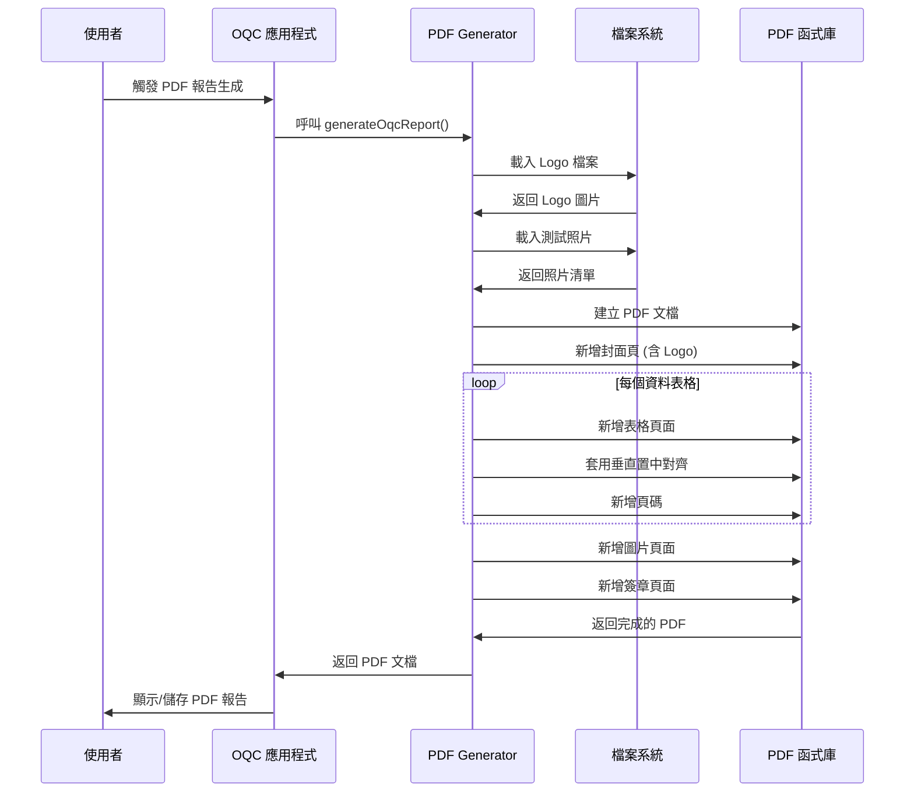
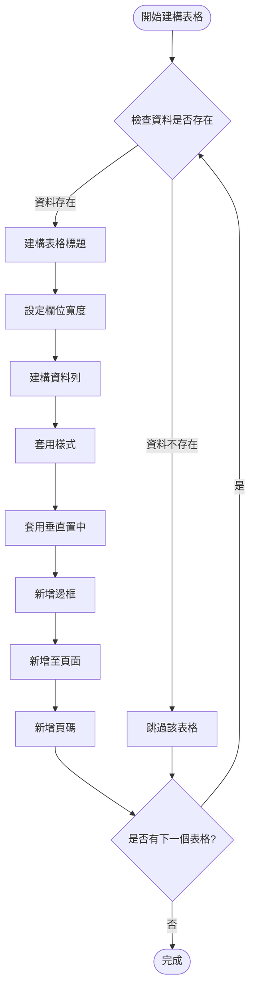
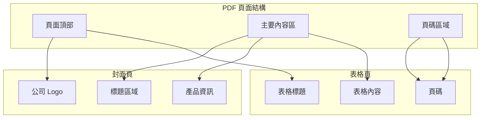

# PDF Generator 使用手冊

**Zerova OQC 系統 PDF 報告生成器指南**  
**版本**: v1.0  
**日期**: 2024年12月  
**適用對象**: 開發人員、測試人員、系統管理員

---

## 📋 目錄

1. [系統概述](#系統概述)
2. [系統架構與流程圖](#系統架構與流程圖)
3. [表格結構說明](#表格結構說明)
4. [PDF 生成過程](#pdf-生成過程)
5. [樣式配置與常數](#樣式配置與常數)
6. [Logo 與圖片處理](#logo-與圖片處理)
7. [頁面佈局與頁碼](#頁面佈局與頁碼)
8. [常見問題排解](#常見問題排解)

---

## 📊 系統概述

Zerova OQC 報告系統的 PDF Generator 負責將測試結果生成為標準化的 PDF 報告，支援以下主要功能：

### 主要功能
- **封面頁生成**: 包含公司 Logo、產品資訊和序號
- **表格渲染**: 10 個標準化表格的生成
- **圖片整合**: 測試照片、參考照片和 Logo 的嵌入
- **頁碼管理**: 自動頁碼和頁面佈局
- **字體統一**: 一致的字體大小和樣式

### 支援的報告內容
- **基本資訊**: 型號、序號、測試人員、日期
- **測試數據**: PSU 序號、軟體版本、特性測試
- **檢查結果**: 外觀檢查、功能測試、保護功能測試
- **附件管理**: 配件包清單、附件照片
- **簽章區**: 負責人簽章和日期

---

## 🏗 系統架構與流程圖

### PDF 生成架構

```mermaid
graph TB
    subgraph "PDF Generator 核心"
        PdfGen[PdfGenerator]
        StyleConst[樣式常數]
        TableBuilder[表格建構器]
        ImageLoader[圖片載入器]
    end

    subgraph "資料模型"
        BasicInfo[基本資訊]
        PsuData[PSU 資料]
        SoftwareData[軟體版本]
        TestResults[測試結果]
        PackageList[配件清單]
    end

    subgraph "檔案系統"
        LogoFile[Logo 檔案]
        TestPhotos[測試照片]
        AttachmentPhotos[附件照片]
        OutputPDF[輸出 PDF]
    end

    subgraph "PDF 表格"
        Table1[基本資訊表]
        Table2[PSU S/N 表]
        Table3[軟體版本表]
        Table4[外觀檢查表]
        Table5[輸入輸出特性表]
        Table6[基本功能測試表]
        Table7[保護功能測試表]
        Table8[Hi-Pot 測試表]
        Table9[配件清單表]
        Table10[附件表]
        Table11[簽章表]
    end

    PdfGen --> StyleConst
    PdfGen --> TableBuilder
    PdfGen --> ImageLoader
    
    BasicInfo --> Table1
    PsuData --> Table2
    SoftwareData --> Table3
    TestResults --> Table4
    TestResults --> Table5
    TestResults --> Table6
    TestResults --> Table7
    TestResults --> Table8
    PackageList --> Table9
    TestPhotos --> Table10
    
    LogoFile --> PdfGen
    TestPhotos --> ImageLoader
    AttachmentPhotos --> ImageLoader
    
    TableBuilder --> OutputPDF
    ImageLoader --> OutputPDF

    classDef core fill:#e1f5fe
    classDef data fill:#f3e5f5
    classDef files fill:#e8f5e8
    classDef tables fill:#fff3e0

    class PdfGen,StyleConst,TableBuilder,ImageLoader core
    class BasicInfo,PsuData,SoftwareData,TestResults,PackageList data
    class LogoFile,TestPhotos,AttachmentPhotos,OutputPDF files
    class Table1,Table2,Table3,Table4,Table5,Table6,Table7,Table8,Table9,Table10,Table11 tables
```



### PDF 生成流程



### 表格建構流程



---

## 📊 表格結構說明

### OQC 報告表格清單

| 表格編號 | 表格名稱 | 對應函數 | 主要內容 |
|---------|---------|----------|----------|
| 1 | 基本資訊表 | 封面頁 | 公司名稱、產品名稱、型號、序號 |
| 2 | PSU S/N 表 | `_buildPsuSerialNumbersTable` | PSU 序號清單和數量 |
| 3 | 軟體版本表 | `_buildSoftwareVersionTable` | 軟體元件版本資訊 |
| 4 | 外觀結構檢查表 | `_buildAppearanceInspectionTable` | 外觀檢查項目和判定結果 |
| 5 | 輸入輸出特性表 | `_buildInputOutputCharacteristicsTable` | 電氣特性測試結果 |
| 6 | 基本功能測試表 | `_buildBasicFunctionTestTable` | 基本功能測試項目 |
| 7 | 保護功能測試表 | `_buildProtectionFunctionTestTable` | 保護功能測試結果 |
| 8 | Hi-Pot 測試表 | `_buildHiPotTestTable` | 絕緣阻抗和絕緣電壓測試 |
| 9 | 配件清單表 | `_buildPackageListTable` | 配件包裝檢查清單 |
| 10 | 附件表 | `_buildAttachmentTable` | 測試照片和文件附件 |
| 11 | 簽章表 | `_buildSignatureTable` | 負責人簽章和日期 |

### 表格共用特性

#### 欄位配置
```dart
// 標準欄位寬度比例
final columnWidths = <int, pw.FlexColumnWidth>{
  0: const pw.FlexColumnWidth(0.5), // 序號欄
  1: const pw.FlexColumnWidth(2.0), // 項目欄
  2: const pw.FlexColumnWidth(1.5), // 數值欄
  3: const pw.FlexColumnWidth(1.0), // 判定欄
};
```

#### 垂直置中對齊
```dart
pw.TableRow(
  verticalAlignment: pw.TableCellVerticalAlignment.middle,
  children: [
    _buildTableCell('內容', font),
  ],
)
```

#### 輔助函數
```dart
// 統一的表格單元格建構器
static pw.Widget _buildTableCell(
  String text,
  pw.Font font, {
  pw.TextAlign textAlign = pw.TextAlign.center,
  int? maxLines,
  double? fontSize,
}) {
  return pw.Container(
    padding: const pw.EdgeInsets.all(5),
    child: pw.Center(
      child: pw.Text(
        text,
        style: pw.TextStyle(
          font: font,
          fontSize: fontSize ?? _defaultFontSize,
        ),
        textAlign: textAlign,
        maxLines: maxLines,
      ),
    ),
  );
}
```

---

## 🔄 PDF 生成過程

### 生成步驟詳解

#### 1. 初始化階段
```dart
Future<pw.Document> generateOqcReport({
  required String modelName,
  required String serialNumber,
  required String pic,
  required String date,
  required BuildContext context,
  // ... 其他參數
}) async {
  final pdf = pw.Document();
  final font = await PdfGoogleFonts.notoSansTCRegular();
  
  // 載入圖片資源
  final logoImage = await _loadLogoImage();
  final packageListImages = await _loadPackageListImages(serialNumber);
  final attachmentImages = await _loadAttachmentImages(serialNumber);
}
```

#### 2. 封面頁生成
```dart
// 包含 Logo 的封面頁
pdf.addPage(
  pw.Page(
    pageFormat: PdfPageFormat.a4,
    build: (context) => pw.Column(
      children: [
        // Logo 區域
        if (logoImage != null) ...[
          pw.SizedBox(height: 60),
          pw.Container(
            height: 160,
            child: pw.Image(logoImage, fit: pw.BoxFit.contain),
          ),
        ],
        // 標題內容...
      ],
    ),
  ),
);
```

#### 3. 表格頁面生成
```dart
// 使用統一的頁面新增函數
addPage(pdf, _buildTableWidget(data, font), font);

// 或使用 MultiPage 處理長內容
pdf.addPage(pw.MultiPage(
  maxPages: 20,
  build: (context) => [tableWidget],
  footer: (context) => pw.Container(
    alignment: pw.Alignment.center,
    child: pw.Text('${context.pageNumber} / ${context.pagesCount}'),
  ),
));
```

#### 4. 圖片整合
```dart
// 圖片載入和處理
static Future<List<pw.Widget>> _loadPackageListImages(String sn) async {
  final directory = path.join(picturesPath, 'Selected Photos', sn, 'Packaging');
  return await ImageUtils.loadAndGroupImages(directory);
}
```

---

## 🎨 樣式配置與常數

### 字體大小常數

```dart
class PdfGenerator {
  // 統一字體大小常數
  static const double _defaultFontSize = 12.0;      // 表格內容
  static const double _titleFontSize = 16.0;        // 表格標題
  static const double _coverTitleFontSize = 24.0;   // 封面主標題
  static const double _coverSubtitleFontSize = 20.0; // 封面副標題
  static const double _coverModelFontSize = 18.0;   // 封面型號
  static const double _smallFontSize = 8.0;         // 頁碼
}
```

### 顏色和佈局

| 元素類型 | 字體大小 | 對齊方式 | 用途 |
|---------|----------|----------|------|
| 封面主標題 | 24px | 置中 | 公司名稱 |
| 封面副標題 | 20px | 置中 | 產品標題 |
| 封面型號 | 18px | 置中 | 產品系列 |
| 表格標題 | 16px | 左對齊 | 各表格標題 |
| 表格內容 | 12px | 置中/左對齊 | 表格資料 |
| 頁碼 | 8px | 置中 | 頁面編號 |

### 間距和邊界
```dart
// 標準間距
pw.SizedBox(height: 10)     // 標題與表格間距
pw.SizedBox(height: 60)     // 封面區塊間距
pw.SizedBox(height: 20)     // 圖片間距

// 表格單元格內距
padding: const pw.EdgeInsets.all(5)

// 頁面邊界
pageFormat: PdfPageFormat.a4  // A4 標準尺寸
```

---

## 🖼 Logo 與圖片處理

### Logo 整合

#### Logo 載入機制
```dart
static Future<pw.ImageProvider?> _loadLogoImage() async {
  try {
    // 優先路徑: assets/logo.png
    const logoPath = 'assets/logo.png';
    final logoFile = File(logoPath);
    
    if (await logoFile.exists()) {
      final logoBytes = await logoFile.readAsBytes();
      return pw.MemoryImage(logoBytes);
    } else {
      // 備選路徑: logo.png (根目錄)
      final logoFile2 = File('logo.png');
      if (await logoFile2.exists()) {
        final logoBytes = await logoFile2.readAsBytes();
        return pw.MemoryImage(logoBytes);
      }
    }
  } catch (e) {
    debugPrint('Error loading logo image: $e');
  }
  return null;
}
```

#### Logo 顯示配置
```dart
// 封面頁 Logo 設定
if (logoImage != null) ...[
  pw.SizedBox(height: 60),        // 頂部間距
  pw.Container(
    height: 160,                  // Logo 最大高度
    child: pw.Image(
      logoImage, 
      fit: pw.BoxFit.contain      // 保持比例，不爆版
    ),
  ),
]
```

### 測試照片處理

#### 圖片載入路徑
```bash
~/Pictures/Zerova/
├── Selected Photos/
│   └── {序號}/
│       ├── Packaging/          # 配件包照片
│       └── Attachment/         # 外觀檢查照片
```

#### 圖片載入函數
```dart
// 配件包照片載入
static Future<List<pw.Widget>> _loadPackageListImages(String sn) async {
  final directory = path.join(picturesPath, 'Selected Photos', sn, 'Packaging');
  return await ImageUtils.loadAndGroupImages(directory);
}

// 附件照片載入
static Future<List<pw.Widget>> _loadAttachmentImages(String sn) async {
  final directory = path.join(picturesPath, 'Selected Photos', sn, 'Attachment');
  return await ImageUtils.loadAndGroupImages(directory);
}
```

---

## 📄 頁面佈局與頁碼

### 頁面佈局結構



### 頁碼實作

#### 單頁模式
```dart
static void addPage(pw.Document pdf, pw.Widget child, pw.Font font) {
  pdf.addPage(
    pw.Page(
      build: (pw.Context context) {
        return pw.Column(
          children: [
            pw.Expanded(
              child: pw.Center(child: child),
            ),
            // 頁碼區域
            pw.Container(
              alignment: pw.Alignment.center,
              padding: const pw.EdgeInsets.only(bottom: 20),
              child: pw.Text(
                '${context.pageNumber} / ${context.pagesCount}',
                style: pw.TextStyle(
                  fontSize: _smallFontSize,
                  font: font,
                ),
              ),
            ),
          ],
        );
      },
      pageFormat: PdfPageFormat.a4,
    ),
  );
}
```

#### 多頁模式
```dart
pdf.addPage(pw.MultiPage(
  maxPages: 20,
  build: (context) => [content],
  footer: (context) => pw.Container(
    alignment: pw.Alignment.center,
    padding: const pw.EdgeInsets.only(top: 20),
    child: pw.Text(
      '${context.pageNumber} / ${context.pagesCount}',
      style: pw.TextStyle(
        fontSize: _smallFontSize,
        font: font,
      ),
    ),
  ),
));
```

---

## ❗ 常見問題排解

### 1. Logo 顯示問題

#### Q: Logo 不顯示或顯示錯誤
**原因**: Logo 檔案路徑錯誤或檔案格式不支援
**解決方案**:
1. 確認 `assets/logo.png` 檔案存在
2. 檢查檔案格式是否為 PNG
3. 確認檔案權限可讀取
4. 檢查檔案大小是否合理

#### Q: Logo 尺寸過大或過小
**原因**: Logo 原始檔案尺寸問題
**解決方案**:
1. 調整 `pw.Container` 的 `height` 值
2. 使用 `pw.BoxFit.contain` 保持比例
3. 確認 Logo 檔案解析度適中

### 2. 表格對齊問題

#### Q: 表格文字沒有垂直置中
**原因**: 缺少 `verticalAlignment` 設定
**解決方案**:
```dart
pw.TableRow(
  verticalAlignment: pw.TableCellVerticalAlignment.middle,
  children: [...],
)
```

#### Q: 表格欄位寬度不均
**原因**: `columnWidths` 設定不當
**解決方案**:
```dart
final columnWidths = <int, pw.FlexColumnWidth>{
  0: const pw.FlexColumnWidth(0.5), // 調整比例
  1: const pw.FlexColumnWidth(2.0),
  // ...
};
```

### 3. 圖片載入問題

#### Q: 測試照片不顯示
**原因**: 圖片路徑錯誤或檔案不存在
**解決方案**:
1. 確認圖片資料夾結構正確
2. 檢查序號是否正確
3. 確認圖片檔案格式支援

#### Q: PDF 檔案過大
**原因**: 圖片檔案太大或數量過多
**解決方案**:
1. 壓縮圖片檔案大小
2. 限制圖片數量
3. 調整圖片品質設定

### 4. 字體和樣式問題

#### Q: 中文字顯示為方塊
**原因**: 字體不支援中文或載入失敗
**解決方案**:
```dart
final font = await PdfGoogleFonts.notoSansTCRegular();
```

#### Q: 表格文字過長被截斷
**原因**: 欄位寬度不足或未設定 `maxLines`
**解決方案**:
```dart
_buildTableCell(
  longText,
  font,
  maxLines: 5,  // 允許多行顯示
)
```

### 5. 頁面佈局問題

#### Q: 頁碼顯示錯誤
**原因**: 頁面計算錯誤或字體載入問題
**解決方案**:
1. 確認所有頁面都使用相同的字體
2. 檢查 `context.pageNumber` 和 `context.pagesCount`
3. 確認頁碼樣式設定正確

#### Q: 表格跨頁時被截斷
**原因**: 表格內容過長但使用單頁模式
**解決方案**:
```dart
// 使用 MultiPage 處理長表格
pdf.addPage(pw.MultiPage(
  build: (context) => [tableWidget],
));
```

---

## 📞 技術支援

### 開發團隊聯絡方式
- **維護者**: Zerova OQC Team
- **相關文檔**: 
  - [SharePoint 整合文檔](./sharepoint.md)
  - [資料結構文檔](./DataStructure.md)

### 相關資源
- [PDF 套件官方文檔](https://pub.dev/packages/pdf)
- [Flutter PDF 最佳實踐](https://flutter.dev/docs/cookbook/persistence/reading-writing-files)
- [Google Fonts for PDF](https://pub.dev/packages/printing#google-fonts)

### 效能最佳化建議

1. **圖片優化**
   - 使用適當的圖片壓縮比例
   - 限制單頁圖片數量
   - 使用 `pw.MemoryImage` 快取機制

2. **記憶體管理**
   - 適時釋放大型圖片資源
   - 分批處理大量資料
   - 避免在同一頁面載入過多內容

3. **程式碼優化**
   - 使用輔助函數減少重複代碼
   - 統一樣式常數管理
   - 實作錯誤處理機制

---

**文檔版本**: v1.0  
**最後更新**: 2024年12月19日  
**下次審查**: 2025年3月
