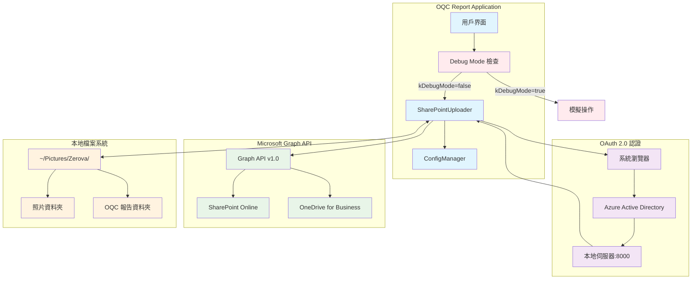
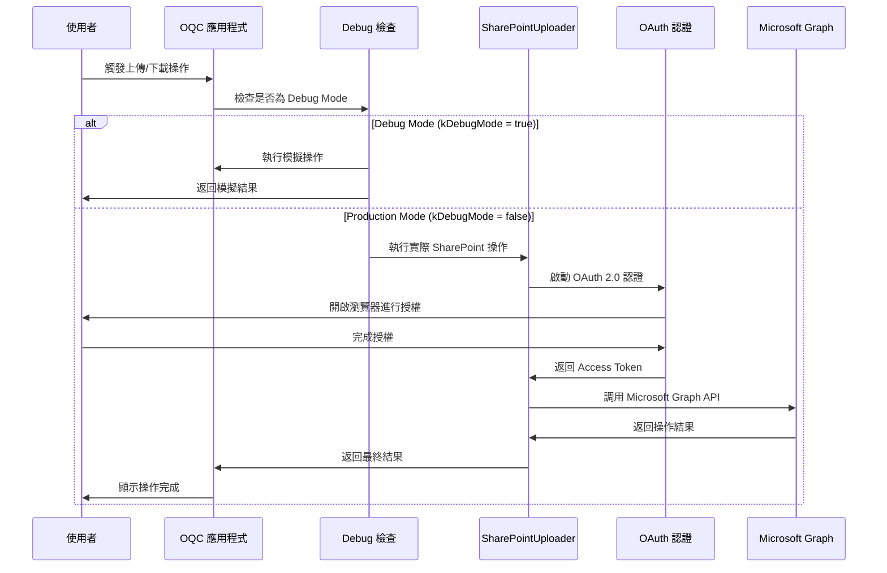
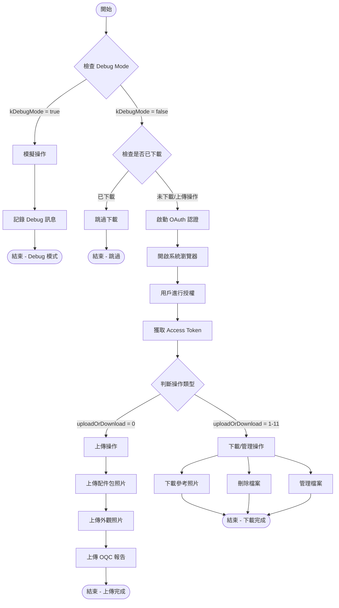
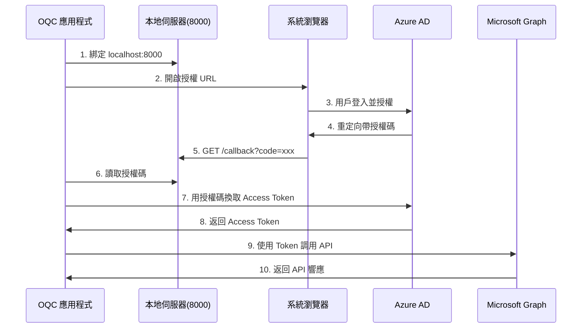

# SharePoint 使用手冊

**Zerova OQC 系統 SharePoint 整合指南**  
**版本**: v1.0  
**日期**: 2024年12月  
**適用對象**: 開發人員、測試人員、系統管理員

---

## 📋 目錄

1. [系統概述](#系統概述)
2. [系統架構與流程圖](#系統架構與流程圖)
3. [OAuth 授權過程](#oauth-授權過程)
4. [Debug Mode 設定](#debug-mode-設定)
5. [SharePoint 使用端點](#sharepoint-使用端點)
6. [檔案結構說明](#檔案結構說明)
7. [常見問題排解](#常見問題排解)

---

## 📊 系統概述

Zerova OQC 報告系統整合 Microsoft SharePoint 來實現檔案管理功能，支援以下主要操作：

### 主要功能
- **上傳功能**: OQC 報告、配件包照片、外觀檢查照片
- **下載功能**: 參考照片、比對照片、手機同步照片
- **管理功能**: 刪除過期檔案、資料夾管理
- **Debug 模式**: 測試環境下的模擬操作

### 支援的檔案類型
- **圖片**: `.jpg`, `.jpeg`, `.png`
- **文件**: `.pdf` (OQC 報告)
- **Excel**: `.xlsx` (測試數據)

---

## 🏗 系統架構與流程圖

### 整體系統架構



### 服務使用流程



### 實作架構流程



---

## 🔐 OAuth 授權過程

### 授權步驟詳解

#### 1. 授權初始化
```dart
// 構建授權 URL
final authUrl = Uri.https(
  "login.microsoftonline.com",
  "$tenantId/oauth2/v2.0/authorize",
  {
    "client_id": clientId,
    "response_type": "code",
    "redirect_uri": "http://localhost:8000/callback",
    "scope": "https://graph.microsoft.com/.default"
  },
);
```

#### 2. 授權流程時序圖



#### 3. 授權配置參數

| 參數名稱 | 說明 | 範例值 |
|---------|------|--------|
| `clientId` | Azure AD 應用程式 ID | `your-azure-app-id` |
| `clientSecret` | 應用程式密鑰 | `your-azure-app-secret` |
| `tenantId` | Azure AD 租戶 ID | `your-azure-tenant-id` |
| `redirectUri` | 回調 URI | `http://localhost:8000/callback` |
| `siteId` | SharePoint 站點 ID | `your-sharepoint-site-id` |
| `driveId` | SharePoint 驅動器 ID | `your-sharepoint-drive-id` |

---

## 🔧 Debug Mode 設定

### Debug Mode 功能

當應用程式在 Debug Mode 下運行時，所有 SharePoint 操作將被自動 bypass，改為執行模擬操作，讓開發者能夠：

- **避免網路連接問題**: 不依賴實際的 SharePoint 連接
- **加速測試流程**: 無需等待實際的上傳/下載操作
- **模擬各種場景**: 可以測試不同的操作模式

### 實作機制

```dart
// SharePointUploader.dart 中的 Debug 檢查
Future<void> startAuthorization({
  Function(String, int, int)? onProgressUpdate,
  required Map<String, String> categoryTranslations,
}) async {
  // 檢查是否為 Debug Mode
  if (kDebugMode) {
    print("Debug Mode: Bypassing SharePoint operations");
    _simulateDebugProgress(onProgressUpdate, categoryTranslations);
    return;
  }
  
  // 正常的 SharePoint 操作...
}
```

### Debug 模擬操作

| 操作類型 | Debug 行為 | 模擬內容 |
|---------|------------|----------|
| 上傳操作 (0) | 模擬上傳進度 | 配件包照片、外觀照片、OQC 報告 |
| 下載比對照片 (1) | 輸出 Debug 訊息 | 模擬下載參考照片 |
| 下載手機照片 (2-3) | 輸出 Debug 訊息 | 模擬下載手機照片 |
| 上傳參考照片 (5,8) | 模擬上傳進度 | 比對照片上傳 |
| 刪除操作 (6,10,11) | 輸出 Debug 訊息 | 模擬刪除檔案 |

### 啟用/停用 Debug Mode

```dart
// Debug Mode 由 Flutter 的 kDebugMode 常數控制
// 在 Debug 建置中自動啟用，在 Release 建置中自動停用

// 檢查目前模式
if (kDebugMode) {
  print("目前運行在 Debug Mode");
} else {
  print("目前運行在 Production Mode");
}
```

---

## 📍 SharePoint 使用端點

### 主要使用位置

#### 1. 檔案載入助手 (LoadFileHelper)
**檔案**: `lib/src/mixin/load_file_helper.dart`
**用途**: 在載入測試數據前下載參考照片

```dart
// 下載外觀參考照片 (uploadOrDownload: 1)
await SharePointUploader(uploadOrDownload: 1, sn: '', model: model)
  .startAuthorization(categoryTranslations: {...});

// 下載配件包參考照片 (uploadOrDownload: 9)  
await SharePointUploader(uploadOrDownload: 9, sn: '', model: model)
  .startAuthorization(categoryTranslations: {...});
```

#### 2. 照片管理標籤 (PhotoManagerTab)
**檔案**: `lib/src/widget/admin/tabs/photo_manager_tab.dart`
**用途**: 管理員界面的外觀參考照片管理

```dart
// 下載外觀參考照片
SharePointUploader(uploadOrDownload: 4, sn: '', model: selectedModel!)

// 上傳外觀參考照片  
SharePointUploader(uploadOrDownload: 5, sn: '', model: selectedModel!)

// 刪除外觀參考照片
SharePointUploader(uploadOrDownload: 11, sn: '', model: selectedModel!)
```

#### 3. 配件包照片管理標籤 (PackagePhotoManagerTab)
**檔案**: `lib/src/widget/admin/tabs/package_photo_manager_tab.dart`
**用途**: 管理員界面的配件包參考照片管理

```dart
// 下載配件包參考照片
SharePointUploader(uploadOrDownload: 7, sn: '', model: selectedModel!)

// 上傳配件包參考照片
SharePointUploader(uploadOrDownload: 8, sn: '', model: selectedModel!)

// 刪除配件包參考照片
SharePointUploader(uploadOrDownload: 10, sn: '', model: selectedModel!)
```

#### 4. 上傳頁面 (Upload)
**檔案**: `lib/src/widget/upload/upload.dart`
**用途**: 上傳 OQC 報告和相關照片

```dart
// 上傳 OQC 報告和照片 (uploadOrDownload: 0)
SharePointUploader(uploadOrDownload: 0, sn: sn, model: model)
  .startAuthorization(onProgressUpdate: onProgressUpdate, ...);
```

### 操作模式對照表

| 模式值 | 操作類型 | 說明 | 使用場景 |
|-------|---------|------|----------|
| 0 | 上傳 OQC 資料 | 上傳配件包照片、外觀照片、OQC 報告 | 完成測試後上傳結果 |
| 1 | 下載比對照片 | 下載外觀參考照片 (有 fallback) | 開始測試前準備參考資料 |
| 2 | 下載手機配件包照片 | 從手機同步配件包照片 | 手機 App 照片同步 |
| 3 | 下載手機外觀照片 | 從手機同步外觀照片 | 手機 App 照片同步 |
| 4 | 下載外觀參考照片 | 下載外觀參考照片 (無 fallback) | 管理員指定模型下載 |
| 5 | 上傳外觀參考照片 | 上傳外觀比對照片 | 管理員上傳新參考照片 |
| 6 | 刪除雙資料夾 | 同時刪除外觀和配件包參考照片 | 管理員清理過期資料 |
| 7 | 下載配件包參考照片 | 下載配件包參考照片 (無 fallback) | 管理員指定模型下載 |
| 8 | 上傳配件包參考照片 | 上傳配件包比對照片 | 管理員上傳新參考照片 |
| 9 | 下載配件包比對照片 | 下載配件包參考照片 (有 fallback) | 開始測試前準備參考資料 |
| 10 | 刪除配件包資料夾 | 批次刪除配件包參考照片 | 管理員清理配件包資料 |
| 11 | 刪除外觀資料夾 | 批次刪除外觀參考照片 | 管理員清理外觀資料 |

---

## 📁 檔案結構說明

### SharePoint 目錄結構

```
SharePoint/Jackalope/
├── All Photos/                    # 測試拍攝的照片
│   └── {SN}/                     # 以序號分類
│       ├── Packaging/            # 配件包照片
│       └── Attachment/           # 外觀檢查照片
├── OQC Report/                   # OQC 測試報告
│   └── {SN}/                     # 以序號分類的 PDF 報告
├── 外觀參考照片/                   # 外觀比對參考照片
│   ├── {Model}/                  # 特定機型的參考照片
│   └── default/                  # 預設參考照片 (fallback)
├── 配件包參考照片/                 # 配件包比對參考照片
│   ├── {Model}/                  # 特定機型的參考照片
│   └── default/                  # 預設參考照片 (fallback)
└── Photos/                       # 手機同步照片
    └── {SN}/
        ├── Attachment/           # 手機拍攝的外觀照片
        └── Packaging/            # 手機拍攝的配件包照片
```

### 本地檔案結構

```
~/Pictures/Zerova/
├── All Photos/                   # 本地拍攝照片
│   └── {SN}/
│       ├── Packaging/
│       └── Attachment/
├── OQC Report/                   # 本地生成的 OQC 報告
│   └── {SN}/
├── Compare Pictures/             # 下載的外觀參考照片
│   ├── {Model}/
│   └── default/
└── Compare Package Pictures/     # 下載的配件包參考照片
    ├── {Model}/
    └── default/
```

### 檔案同步規則

| 本地路徑 | SharePoint 路徑 | 同步方向 | 說明 |
|---------|----------------|---------|------|
| `All Photos/{SN}/` | `All Photos/{SN}/` | 上傳 | 測試照片上傳 |
| `OQC Report/{SN}/` | `OQC Report/{SN}/` | 上傳 | 報告上傳 |
| `Compare Pictures/{Model}/` | `外觀參考照片/{Model}/` | 下載 | 參考照片下載 |
| `Compare Package Pictures/{Model}/` | `配件包參考照片/{Model}/` | 下載 | 參考照片下載 |

---

## ❗ 常見問題排解

### 1. 授權問題

#### Q: 無法獲取 Access Token
**原因**: Azure AD 設定錯誤或網路問題
**解決方案**:
1. 確認 Azure AD 應用程式註冊設定
2. 檢查 Client ID 和 Client Secret 是否正確
3. 確認重定向 URI 為 `http://localhost:8000/callback`
4. 檢查租戶 ID 是否正確

#### Q: 瀏覽器無法開啟授權頁面
**原因**: 系統瀏覽器設定或防火牆問題
**解決方案**:
1. 檢查預設瀏覽器設定
2. 確認防火牆允許應用程式網路存取
3. 手動複製授權 URL 到瀏覽器

### 2. 上傳/下載問題

#### Q: 檔案上傳失敗 (HTTP 403/404)
**原因**: SharePoint 權限或路徑錯誤
**解決方案**:
1. 確認 SharePoint 權限設定
2. 檢查 Site ID 和 Drive ID 是否正確
3. 驗證檔案路徑格式
4. 確認 Microsoft Graph API 權限範圍

#### Q: 本地伺服器綁定失敗 (Port 8000)
**原因**: 連接埠被佔用或權限不足
**解決方案**:
1. 檢查連接埠 8000 是否被其他程式佔用
2. 以管理員權限執行應用程式
3. 確認防火牆設定

### 3. Debug Mode 問題

#### Q: Debug Mode 下仍然嘗試連接 SharePoint
**原因**: `kDebugMode` 判斷錯誤或建置設定問題
**解決方案**:
1. 確認應用程式以 Debug 模式建置
2. 檢查 `import 'package:flutter/foundation.dart';` 是否正確匯入
3. 驗證 `kDebugMode` 常數值

#### Q: Production 環境意外啟用 Debug Mode
**原因**: 建置配置錯誤
**解決方案**:
1. 確認使用 Release 模式建置應用程式
2. 檢查建置指令和設定檔

### 4. 效能問題

#### Q: 大檔案上傳速度慢
**原因**: 網路速度或檔案大小限制
**解決方案**:
1. 使用分塊上傳 (chunked upload) 機制
2. 壓縮圖片檔案大小
3. 檢查網路連接品質

#### Q: 大量檔案下載超時
**原因**: 網路超時或批次處理問題
**解決方案**:
1. 實作重試機制
2. 分批處理大量檔案
3. 增加網路超時設定

---

## 📞 技術支援

### 開發團隊聯絡方式
- **維護者**: Zerova OQC Team
- **技術文件**: [SharePoint Graph API 文件](./SharePointGraphAPI.md)
- **資料結構**: [資料結構文檔](./DataStructure.md)

### 相關資源
- [Microsoft Graph API 官方文檔](https://docs.microsoft.com/en-us/graph/)
- [Azure AD OAuth 2.0 文檔](https://docs.microsoft.com/en-us/azure/active-directory/develop/)
- [SharePoint API 參考](https://docs.microsoft.com/en-us/graph/api/resources/sharepoint)

---

**文檔版本**: v1.0  
**最後更新**: 2024年12月19日  
**下次審查**: 2025年3月
